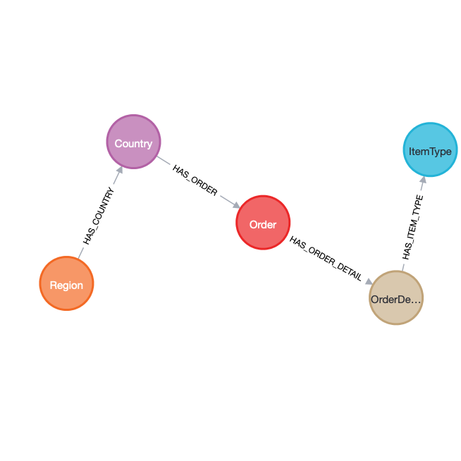

Simple Docker Compose based on [this repo](https://github.com/cluster-apps-on-docker/spark-standalone-cluster-on-docker), it contains some examples on how to use the Spark Neo4j Connector.


To start the project, just run:

```shell
# -d is for detached mode (runs everything in background)
docker compose up -d
```

To check the status of the cluster through the spark UI, just connect to:
```shell
http://<ip_address_of_the_machine>:8080
```

If you want to code directly from the cluster, connect to Jupyterlab on:
```shell
http://<ip_address_of_the_machine>:8888
```

If you want to access the Neo4j Browser of the container defined inside the docker-compose file (right now is commented, uncomment it only if you currently don't have a Neo4j instance on your machine or, if you want to have multiple Neo4j instances, provide different ports to the Neo4j container to prevent errors):
```shell
http://<ip_address_of_the_machine>:<external_port_of_the_neo4j_contaniner_mapped_to_internal_7474>
```

From Jupyter Lab, you will see that in the workspace there are different Python Notebooks that will guide you on your first steps using the Neo4j Connector for Spark.

This repository contains two different Python Notebooks:

1. [simple_read_from_neo4j.ipynb](shared-workspace/simple_read_from_neo4j.ipynb) : In this notebook you will see how you can read data from Neo4j by running queries using the Spark Connector for Neo4j.

2. [write_to_neo4j.ipynb](shared-workspace/write_to_neo4j.ipynb) : In this notebook you will test the ingestion of a dataset of commercial orders. The ingestion process, without the creation of the Spark DataFrame, running the environment on a testing machine with 16Gb of RAM and a CPU with 4 cores, took almost 150 seconds (2.5 minutes).

The final graph will have around 1.9 mln nodes and 2.6 mln relationships and the final schema that your database will have is: 

